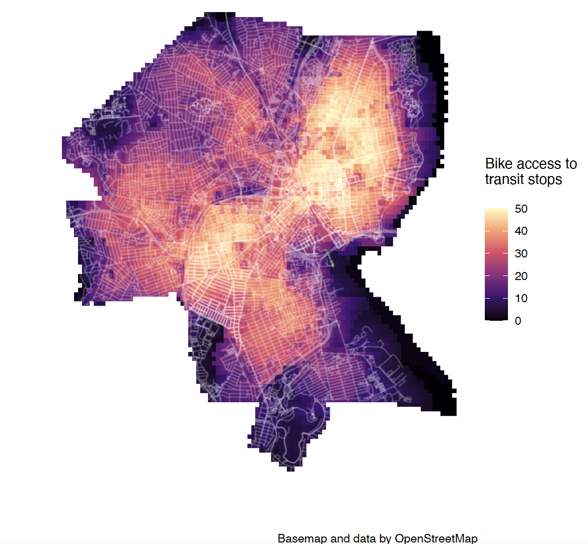

# Introduction  

This portfolio displays 8 maps I created as part of the course **VIS 2128 - Spatial Analysis** at the Harvard Graduate School of Design. The maps were created using R (for all maps except map 7, which was created in QGIS). Each map represents one or more of the following skills:

* Displaying multiple vector layers on the same map  
* Calculating and displaying relationships among point and polygon layers based on distance  
* Aggregating point data to a layer of polygons  
* Calculating and displaying accessibility, based on travel time  
* Converting between raster layers and vector layers  
* Displaying raster data on a map  
* Georeferencing a raster image  
* Displaying data on an interactive map  

I would like to acknowledge and thank Prof. Carole Turley Voulgaris for her immense efforts as the instructor for this course, and the teaching assistants for VIS 2128, for all their help and support.

# Boston, Massachusetts  

## Map 1: Boston Neighborhoods, EV Charging Stations, Libraries and Social Vulnerability  

**Key skill: Displaying multiple vector layers on the same map**

This map shows four vector layers in Boston including two point layers (electric vehicle charging stations and public libraries) and two polygon layers (neighborhoods and social vulnerability).

Note: The social vulnerability layer represents data sourced from the 2008-2012 American Community Survey 5-year Estimates (ACS) data by census tract for low-to- no income populations. The data represents a calculated field that combines people who were 100% below the poverty level and those who were 100–149% of the poverty level.

{target="_blank"}

## Map 2: Boston public libraries by distance to electric vehicle charging stations  

**Key skill: Calculating and displaying relationships among point and polygon layers based on distance**

This map shows Boston public libraries in relation to whether or not they are within 0.5 miles of an electric vehicle charging station. Of the 26 public libraries in Boston, 8 are withing 0.5 miles of an electric vehicle charging station.

{target="_blank"}

## Map 3: Number of Boston public libraries within neighborhoods  

**Key skill: Aggregating point data to a layer of polygons**

This map shows the number of public libraries in Boston within each neighborhood. Dorchester has the highest number of libraries across all neighborhoods.

{target="_blank"}

# Providence, Rhode Island  

## Map 4: Travel time to cafes in Providence  

**Key skill: Calculating and displaying accessibility, based on travel time**

This map shows areas in Providence that are within 5 minutes, 10 minutes and 20 minutes to the nearest cafe. 

{target="_blank"}

## Map 5: Biking accessibility to transit stops in Providence - contour layers  

**Key skill: Converting between raster layers and vector layers**

This map uses contours to show accessibility to transit stops in Providence, by bike. The accessibility score was calculated using an exponential decay function, and the map was first plotted as a raster layer and then converted to a vector (contour) layer.

{target="_blank"}

## Map 6: Biking accessibility to transit stops in Providence - raster layers  

**Key skill: Displaying raster data on a map**

This map uses raster data to show accessibility to transit stops in Providence, by bike. The accessibility score was calculated using an exponential decay function.

{target="_blank"}

# Reykjavik, Iceland  

## Map 7: Georeferenced map of Reykjavik in 1902 with hiking and cycling trails from 2019  

**Key skill: Georeferencing a raster image**

This map includes 3 layers visualizing Reykjavik, Iceland. The base layer is the OpenStreetMap, which was used to georeference the second layer, the historic map of Reykjavik from 1902 (sourced from the Harvard library map archive). The third layer on top is a vector layer, in maroon, demonstrating the hiking and cycling trails from 2019.The map visually demonstrates how the city has developed from 1902 to 2019 – we see new trails in 2019 both within and outside the city boundaries that existed in 1902. It is particularly interesting to note the extension of the land mass into the ocean from 1902 to 2019, as seen in the trails that extend into the ocean at the top of the city boundaries in the historic map.

{target="_blank"}

# Middlesex County, Massachusetts

## Map 8: Interactive map of geographic mobility in Middlesex county by poverty levels

**Key skill: Displaying data on an interactive map**

This map represents the number of people in Middlesex County who moved from abroad in the last year, categorized based on their poverty status. The user can toggle between the poverty status layers using the toggle options in the top right part of the map, and the legend describing the colors is included in the bottom right. Users can also click on the polygons for more information.

{target="_blank"}
